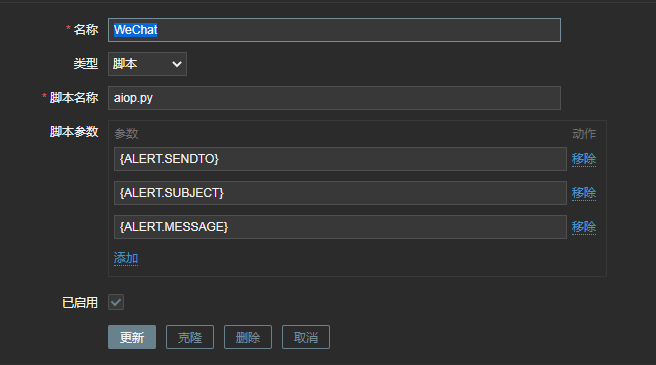

# 告警通知

## 准备工作

### Python环境， 用于执行

安装`yum install python2-pip`

requests模块用于模拟http请求

安装 `pip install requests`

或直接安装`yum install python2-requests`

## 执行脚本

zabbix-server.conf配置的默认告警脚本路径，

`AlertScriptsPath=/usr/lib/zabbix/alertscripts`

将python脚本上传到该目录下，并授权755使得zabbix用户可以执行该脚本。

脚本示例如下：

```
#!/usr/bin/env python
# coding=utf-8

import json
import requests
import sys
import os
import urllib3

urllib3.disable_warnings()
reload(sys)
sys.setdefaultencoding('utf-8')
aiopUrl = 'http://192.168.0.215:8091'
username = 'admin'
password = '123456'
tokenFile = '/tmp/aiop_token'


def isJson(myjson):
    try:
        json.loads(myjson)
    except ValueError:
        return False
    return True


def getTokenFromServer():
    url = aiopUrl + '/auth/login'
    data = {'u': username, 'p': password}
    r = requests.get(url=url, params=data)
    if hasattr(r.json(), 'code'):
        return False
    else:
        token = r.json()['accessToken']
        tmpFile = open(tokenFile, 'w')
        tmpFile.write(token)
        tmpFile.close()
        return token


def sendMessage(user, subject, message):
    if os.path.exists(tokenFile):
        tmpFile = open(tokenFile, 'r')
        token = tmpFile.read()
        tmpFile.close()
    else:
        token = getTokenFromServer()

    n = 0
    url = aiopUrl + '/msg/wx'
    headers = {
        'Content-Type': 'application/json',
        'Access-Token': token
    }
    data = {
        'user': user,
        'subject': subject,
        'message': message
    }
    r = requests.post(url=url, headers=headers, data=json.dumps(data))

    while isJson(r.text) and n < 4:
        n += 1
        token = getTokenFromServer()
        if token:
            r = requests.post(url=url, headers=headers, data=json.dumps(data))

    return r.text


if __name__ == '__main__':
    print('开始')
    arg1 = str(sys.argv[1])  # zabbix传过来的第一个参数
    print('发送人：%s' % arg1)
    arg2 = str(sys.argv[2])  # zabbix传过来的第二个参数
    print('标题：%s' % arg2)
    arg3 = str(sys.argv[3])  # zabbix传过来的第二个参数
    print('内容：%s' % arg3)

    getTokenFromServer()
    rr = sendMessage(arg1, arg2, arg3)
    print(rr)

    print('结束')
```

## Zabbix配置

1. 管理 > 报警媒介类型 > 创建媒体类型



2. 管理 > 用户 > 报警媒介 > 添加报警媒介


3. 配置 > 动作 > 创建动作


4. 配置 > 动作 > 创建动作 > 操作


