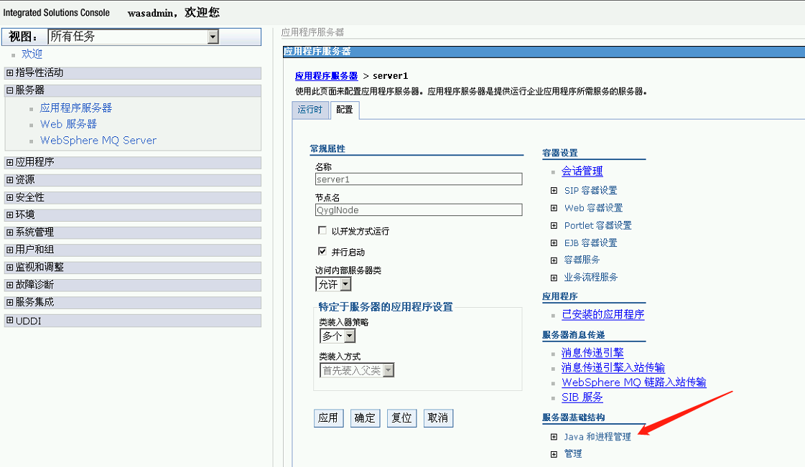
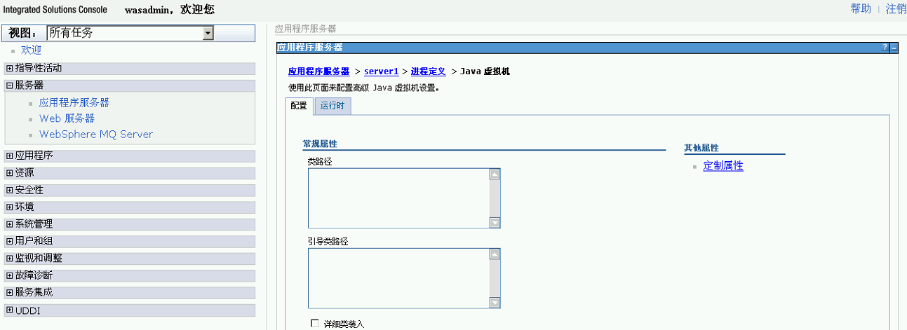

# JMX

官方文档：

[JMX监控](https://www.zabbix.com/documentation/4.0/zh/manual/config/items/itemtypes/jmx_monitoring)

[发现JMX对象](https://www.zabbix.com/documentation/4.0/zh/manual/discovery/low_level_discovery/jmx)


## zabbix-java-gateway

- 安装`yum install zabbix-java-gateway`
- 配置文件`/etc/zabbix/zabbix_java_gateway.conf`
- 日志配置文件`/etc/zabbix/zabbix_java_gateway_logback.xml`
- 修改`zabbix_server.conf`
    - JavaGateway=127.0.0.1  #修改为zabbix-java-gateway所在主机的ip地址，这里是和zabbix-server安装在同一台主机所以为127.0.0.1
    - JavaGatewayPort=10052  #默认监控端口为10052
    - StartJavaPollers=16    #建议和CPU核数相等

## Tomcat

创建配置文件`vim /etc/tomcat/conf.d/jmx.conf`

```
export CATALINA_OPTS="-Dcom.sun.management.jmxremote 
-Dcom.sun.management.jmxremote.port=12345
-Dcom.sun.management.jmxremote.rmi.port=12345
-Dcom.sun.management.jmxremote.ssl=false 
-Dcom.sun.management.jmxremote.authenticate=false 
-Djava.rmi.server.hostname=<本机IP>"
```

重启tomcat`systemctl restart tomcat`

防火墙开启12345端口

Zabbix配置主机的宏，将默认的nio改成bio

[Tomcat MBean](https://tomcat.apache.org/tomcat-7.0-doc/funcspecs/mbean-names.html)
[参考文档](https://blog.csdn.net/wzc900810/article/details/81096070)


## WebSphere

常见的两种方案：
1. 通过perfServletApp进行监控

    perfServletApp项目是由WebSphere提供的（在安装目录下可以找到PerfServletApp.ear ，默认没有部署），用于简单的端对端检索性能数据， IBM或第三方供应商提供的任何工具都可以处理此性能数据。通过servlet访问，返回XML 格式的信息，然后解析XML即可获得相应的监控数据。
   
2. 使用JMX 接口开发监控程序

    通过使用PerfMBean或个别MBean，您可使用AdminClient API获取性能监控基础结构（ PMI ）数据。

从console上开启jmx [参考文档](https://www.cnblogs.com/zhaojiankai/p/6920149.html)

服务器 > 应用程序服务器 > server1 > 配置 > 服务器基础结构 > Java和进程管理



进程定义 > Java虚拟机



通用 JVM 参数


定制属性
```
Name: java.rmi.server.hostname
Value: <本机IP>
Name: com.sun.management.jmxremote
Value: true
Name: com.sun.management.jmxremote.port
Value: 12345
Name: com.sun.management.jmxremote.rmi.port
Value: 12345
Name: com.sun.management.jmxremote.ssl
Value: false
Name: com.sun.management.jmxremote.authenticate
Value: false
```

[IBM MBean](https://www.ibm.com/support/knowledgecenter/zh/SSEQTP_liberty/com.ibm.websphere.wlp.doc/ae/rwlp_mbeans_list.html)


## 东方通TongWeb

ps -ef|grep tong

conf/tongweb.xml中address指定ip
<jmx-service port="7201" address="192.168.0.151" protocol="rmi"/>

控制条添加jvm变量
-Djava.rmi.server.hostname=192.168.0.151
-Dtongweb.jconsole.cbport=7201
-Dtongweb.rmijmx.cbport=7201

http://192.168.0.151:9061/console/
用户名/密码:thanos/thanos123.com

service:jmx:rmi:///jndi/rmi://192.168.0.151:7201/jmxrmi
用户名/密码:thanos/thanos123.com


## jconsole

jdk安装时候选择工具，bin目录下有jconsole.exe


## zabbix配置

可以通过jmx.discory模块发现可用的mbean的名称和属性
[JMX自动发现参考文档](https://www.zabbix.com/documentation/4.0/zh/manual/discovery/low_level_discovery/jmx)
[JMX监控参考文档](https://www.zabbix.com/documentation/4.0/zh/manual/config/items/itemtypes/jmx_monitoring)


